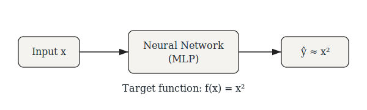

## Neural Network Approximation of $f(x) = x^2$

This document demonstrates how a simple neural network can approximate the nonlinear function

$$
f(x) = x^2
$$

We will study:

1. Theoretical basis (universal approximation).
2. Function approximation as regression.
3. Network architecture design.
4. Loss formulation and optimization.
5. PyTorch implementation.
6. Quantitative and visual evaluation.

---

## 1. Problem Definition

We want to learn a function

$$
\hat{f}_\theta(x) \approx x^2
$$

where $\hat{f}_\theta$ is a neural network parameterized by weights $\theta$.

This is a **supervised regression problem**:

$$
\mathcal{D} = \{(x_i, y_i)\}, \quad y_i = x_i^2
$$

Goal:

$$
\theta^* = \arg\min_\theta \sum_{i=1}^N \ell(\hat{f}_\theta(x_i), y_i)
$$

---

## 2. Why Can a Neural Network Approximate $x^2$?

### Universal Approximation Theorem

A feedforward neural network with:

- At least one hidden layer
- Nonlinear activation function (ReLU, Tanh, Sigmoid)

can approximate any continuous function on a compact domain arbitrarily well:

$$
\forall \epsilon > 0,\quad \exists \theta \text{ such that }
\|\hat{f}_\theta(x) - f(x)\| < \epsilon
$$

Since $x^2$ is continuous on any bounded interval $[-a, a]$, it can be approximated.

---

### Polynomial View

A neural network computes nested affine maps and nonlinearities:

$$
h = \sigma(Wx + b)
$$

$$
\hat{y} = Vh + c
$$

With nonlinear activations, this forms a flexible basis expansion capable of representing quadratic curvature.

---

## 3. Dataset Construction

We sample uniformly from a bounded interval:

$$
x \sim \mathcal{U}(-2, 2), \quad y = x^2
$$

We generate $N$ samples.

---

## 4. Model Architecture

We use a small multilayer perceptron:

$$
x \in \mathbb{R}^1
\rightarrow \text{Linear}(1 \to 32)
\rightarrow \text{ReLU}
\rightarrow \text{Linear}(32 \to 32)
\rightarrow \text{ReLU}
\rightarrow \text{Linear}(32 \to 1)
$$

Mathematically:

$$
h_1 = \sigma(W_1 x + b_1)
$$

$$
h_2 = \sigma(W_2 h_1 + b_2)
$$

$$
\hat{y} = W_3 h_2 + b_3
$$

---

## 5. Loss Function

We minimize Mean Squared Error (MSE):

$$
\mathcal{L}(\theta) = \frac{1}{N} \sum_{i=1}^N (\hat{y}_i - y_i)^2
$$

This corresponds to maximum likelihood under Gaussian noise.

---

## 6. Optimization

We use Adam optimizer:

$$
\theta_{t+1} = \theta_t - \alpha \frac{m_t}{\sqrt{v_t} + \epsilon}
$$

Adam adapts learning rates per parameter.

---

## Network Approximation Pipeline

<div align="center">

</div>

**Figure:** Neural network learns a nonlinear mapping from $x$ to $\hat{y} \approx x^2$ using supervised regression.

---

# 7. PyTorch Implementation

```python
import torch
import torch.nn as nn
import torch.optim as optim
import matplotlib.pyplot as plt

# -------------------------
# Data Generation
# -------------------------
N = 2000
x = torch.linspace(-2, 2, N).unsqueeze(1)
y = x ** 2

# -------------------------
# Model Definition
# -------------------------
class MLP(nn.Module):
    def __init__(self):
        super().__init__()
        self.net = nn.Sequential(
            nn.Linear(1, 32),
            nn.ReLU(),
            nn.Linear(32, 32),
            nn.ReLU(),
            nn.Linear(32, 1)
        )

    def forward(self, x):
        return self.net(x)

model = MLP()

# -------------------------
# Training Setup
# -------------------------
criterion = nn.MSELoss()
optimizer = optim.Adam(model.parameters(), lr=0.01)

# -------------------------
# Training Loop
# -------------------------
epochs = 2000
losses = []

for epoch in range(epochs):
    y_pred = model(x)
    loss = criterion(y_pred, y)

    optimizer.zero_grad()
    loss.backward()
    optimizer.step()

    losses.append(loss.item())

    if epoch % 200 == 0:
        print(f"Epoch {epoch:4d} | Loss = {loss.item():.6f}")

# -------------------------
# Evaluation
# -------------------------
with torch.no_grad():
    y_hat = model(x)

# Plot approximation
plt.figure(figsize=(6,4))
plt.plot(x.numpy(), y.numpy(), label="True $x^2$")
plt.plot(x.numpy(), y_hat.numpy(), "--", label="NN Approximation")
plt.legend()
plt.xlabel("x")
plt.ylabel("y")
plt.title("Neural Network Approximation of $x^2$")
plt.show()

# Plot training loss
plt.figure(figsize=(6,4))
plt.plot(losses)
plt.xlabel("Epoch")
plt.ylabel("MSE Loss")
plt.title("Training Loss Curve")
plt.show()
